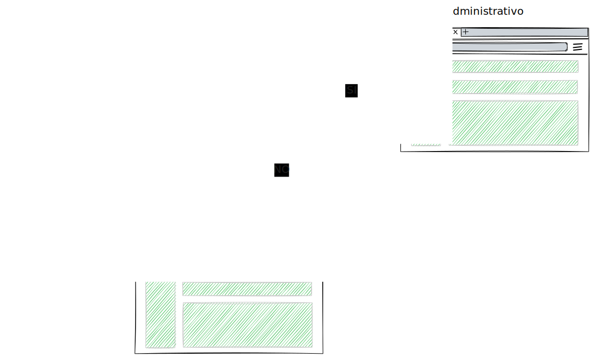
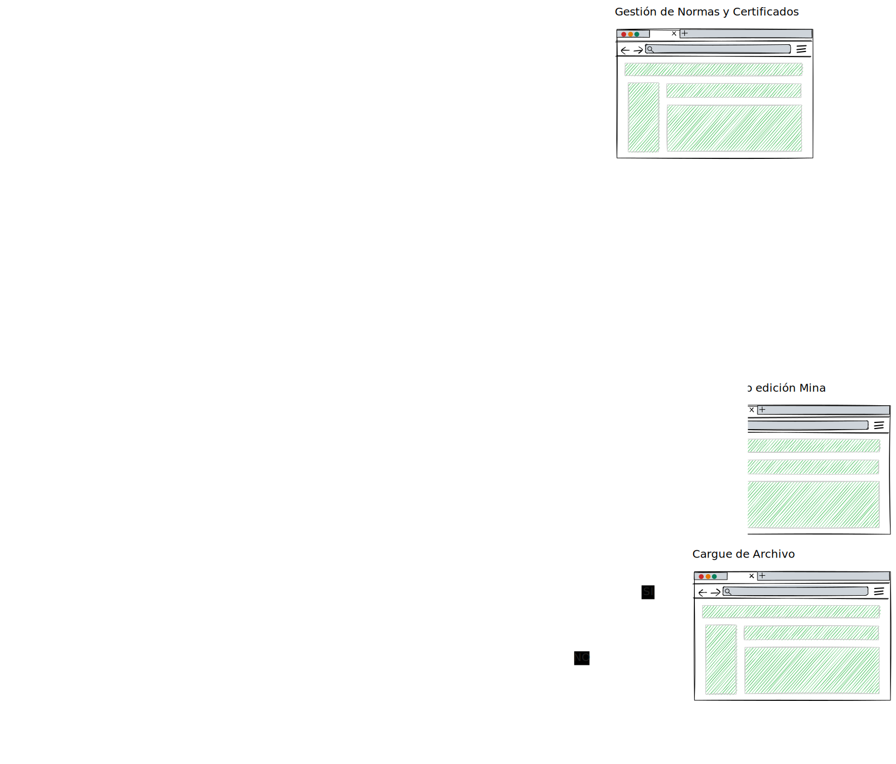

 # **Documento de Diseño: Capa de Aplicación de Sistema IoT para Monitoreo de Minas Subterráneas**

## **Antecedentes**
Boyacá, según datos de la Agencia Nacional Minera, es el departamento con mayor tasa de accidentalidad y mortalidad en Colombia, siendo la mineria subterranea de carbón la que más registros asociados tiene. Con la implementación de tecnología podemos abordar esta problematica apuntando no solo a disminuir la tasa de accidentalidad y mortalidad minera en el departamento, sino que también podemos contribuir en la mejora de las condiciones laborales de los mineros y demás trabajadores involucrados. 
El proyecto planteado busca, a nivel de capa de aplicación de un Sistema IoT, el determinar y diseñar módulos que funcionalmente vayan orientados a la prevención de desastres y generación de alertas oportunas para partes interesadas como lo pueden ser la Agencia Nacional Minera, el Ministerio de Minas, organismos de prevención y asistencia a desastres, entre otros. A partir de lo anterior se infiere inicialmente la gestión de sensores y dispositivos IoT que podemos encontrar en las capas inferiores de un sistema IoT.

## **Problema**
Los diferentes sistemas IoT desarrollados a dia de hoy para la industria minera en su mayoría fueron diseñados e implementados para minas grandes con capacidad economica superior a la de minas medianas y pequeñas, del departamento de Boyacá.

Con el fin de reducir costos se analizan soluciones de código libre, pero se identifica baja capacidad funcional para lo requerido en este contexto. Adicionalmente encontramos soluciones de código libre, como la versión community de [Thingsboard](https://thingsboard.io/) que, a pesar de ser una solución bastante completa, no cubre el registro de sensores y dispositivos IoT que estén aprobados bajo alguna normativa que indique su uso seguro en minas subterraneas de carbón.

Por tanto, se llega a la conclusión de que es necesario diseñar y determinar una solución que considere el contexto de empresas mineras pequeñas, que sea de código libre y que vaya alineada con normativas seguidas por organismos gubernamentales del país como la Agencia Nacional Minera.

## **Objetivos**
- Clasificar y diseñar de microservicios basados en las necesidades de seguridad y salud en el trabajo en minas de la provincia de Sugamuxi.
- Diseñar la capa de aplicación de un sistema IoT utilizando microservicios para el monitoreo de variables ambientales y fisiológicas en minas subterráneas en la provincia de Sugamuxi, Boyacá, enfocado en la seguridad de las labores mineras.
- Desarrollar un prototipo de sistema IoT con base en el diseño anteriormente planteado.


## **No Objetivos**
1. Manejo de minas fuera de la provincia de Sugamuxi.
2. Aplicaciones específicas para el usuario final más allá de la visualización de datos y generación de alertas.

## **Solución Propuesta**
Desarrollo de la capa de aplicación de un sistema IoT con los siguientes módulos:

1. **Módulo de Visualización en 3D**: Generación automática de un modelo 3D de la disposición de los nodos sensores a partir de un archivo que detalle su distribución dentro de la mina.
2. **Módulo de Monitoreo en Tiempo Real**: Consume los datos enviados por los sensores y los refleja en la visualización 3D, generando alertas.
3. **Módulo de Registro de Sensores**: Gestiona el registro de sensores y garantiza el cumplimiento de normativas internacionales, con la posibilidad de definir y actualizar rangos de operación (de lo revisado puede ser similar a un **Rule Engine**.
4. **Módulo de Interoperabilidad de Datos**: Asegura que los datos sean consumidos de manera eficiente por las partes interesadas, utilizando **formatos estandarizados** como JSON y XML, y el **protocolo MQTT** para la transmisión de datos. Este módulo incluirá la posibilidad de gestionar el formato de los datos recibidos, permitiendo a los usuarios definir, seleccionar o modificar estándares de formato de datos, según las normativas vigentes. Esto garantizará la flexibilidad y actualización de los formatos conforme cambien las normativas.

## **Requisitos**
### Funcionales:
- Carga y análisis de archivos de distribución de nodos sensores.
- Actualizaciones en tiempo real de las variables ambientales y fisiológicas.
- Verificación de cumplimiento para el registro de sensores.
- Estandarización de formatos de datos y protocolos para la interoperabilidad.

### No Funcionales:
- Alta confiabilidad para monitoreo en tiempo real.
- Escalabilidad para manejar múltiples minas.
- Cumplimiento de estándares de seguridad.

## **Decisiones Clave de Diseño**
1. **Protocolo MQTT**: Seleccionado para la transferencia de datos en tiempo real debido a su bajo ancho de banda y escalabilidad.
2. **Formatos de Datos Estandarizados**: Se soportarán JSON y XML para facilitar la integración con sistemas externos.
3. **Cumplimiento de Normativas para Sensores**: Se incluirán estándares predefinidos (ATEX, OSHA) con la opción de que los usuarios actualicen las normativas.

## **Preguntas Abiertas**
- ¿Cómo manejará el sistema picos de datos en tiempo real?
- ¿Deberíamos permitir que los usuarios definan rangos personalizados más allá de los estándares de seguridad predefinidos?

## Diagrama de dependencia entre módulos

## Diagrama de Microservicios y dependencia entre ellos


## MockUps UI
### Flujo de Navegación del Inicio de Sesión

### Flujo de Navegación principal y otras vistas

## Registro de Sensores
### UI


### Modelo de datos
El **id_nodo** es un dato que de momento se pueda ingresar de una vez en el registro del sensor. 

El **id** del sensor es un dato que se genera automaticamente, por lo que en el formulario de registro no se solicita.
```json
{
  "id_nodo": "NODE_1-ASDS-AS",
  "id":"SENSOR_CH4_232",
  "variable":"CH4",
  "marca": "Honeywell",
  "referencia": "Sensepoint XRL CH4",
  "datos_medicion": {
	"unidad": "% LEL",
    "max": 100,
    "min": 0,
    "precision": 2,
    "tiempo_respuesta": {
      "valor": 30,
      "unidad": "s"
    },
    "resolucion":0.1,
  },
  "condiciones_operativas": {
    "temperatura_operativa": {
      "unidad": "°C",
      "max": 50,
      "min": -20
    },
    "voltaje": {
      "unidad": "V",
      "tipo": "DC",
      "min": 10,
      "max": 28
    },
    "corriente": {
      "unidad": "mA",
      "min": 80,
      "max": 200
    },
    "durabilidad": {
      "valor": 24,
      "unidad": "meses"
    },
    "modo_instalacion": "Montaje en pared, a prueba de explosiones"
  },
  "datos_salida": {
    "tipo_salida": [
      "Señal analógica 4-20mA",
      "Modbus RTU (RS-485)"
    ]
  },
  "certificados": [
    "ATEX",
    "IECEx",
    "UL"
  ]
}


```

## Roles
- Administrador: Tiene los permisos de CRUD sobre el Módulo de Gestión de Normativas, Módulo de Interoperabilidad (gestión de topics MQTT).
- Operador: Tiene los permisos de vista a los módulos de visualización de datos 3D en tiempo real, registro de sensores.